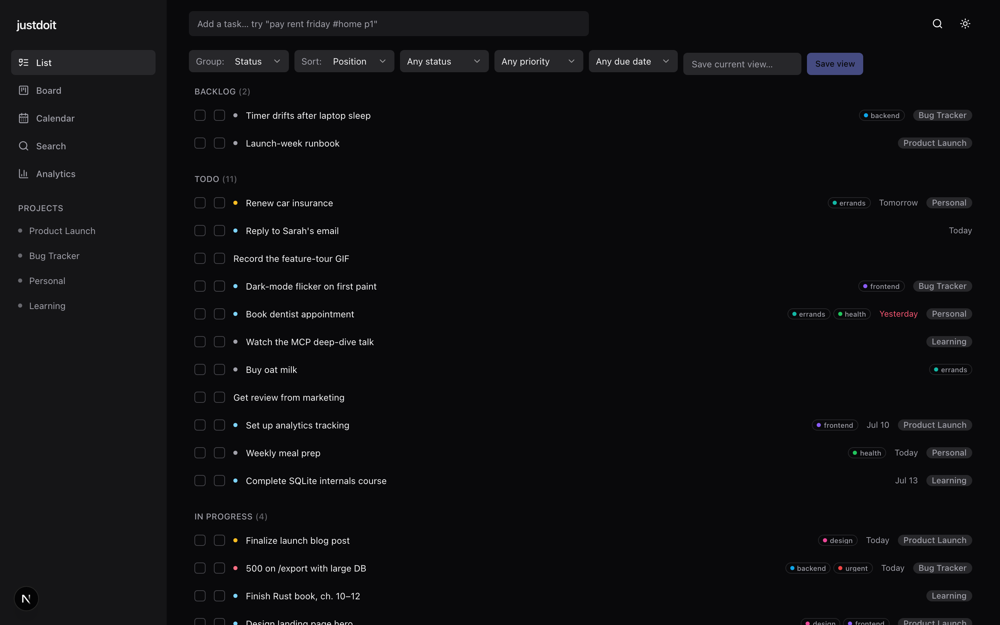
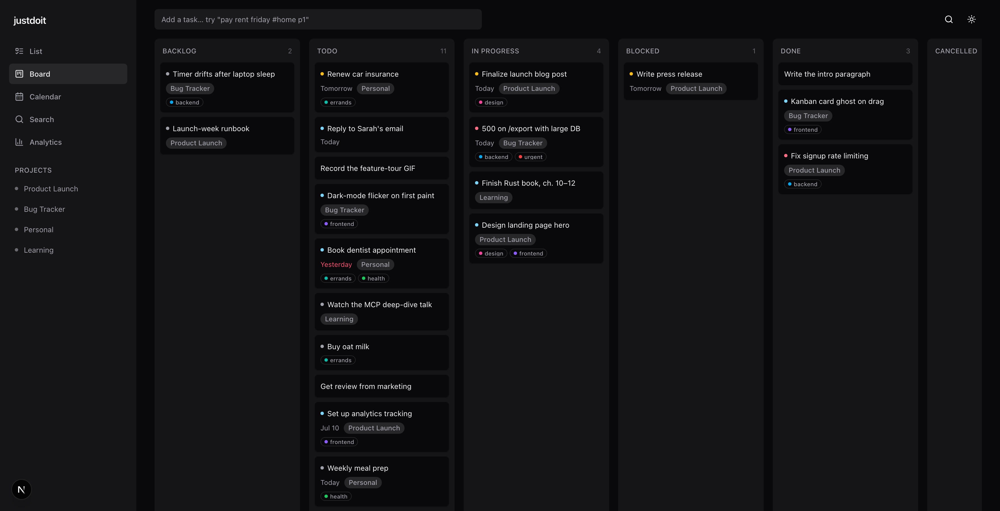
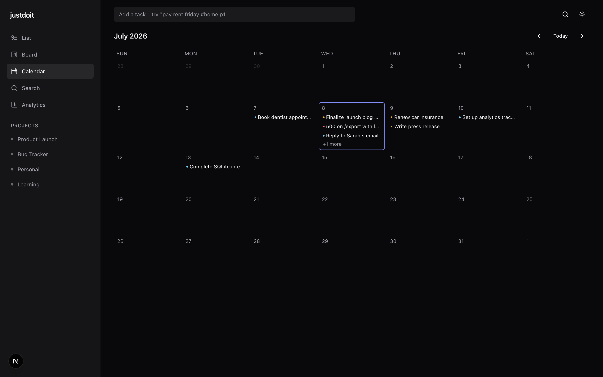
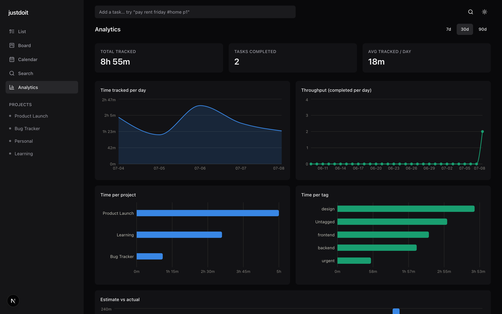
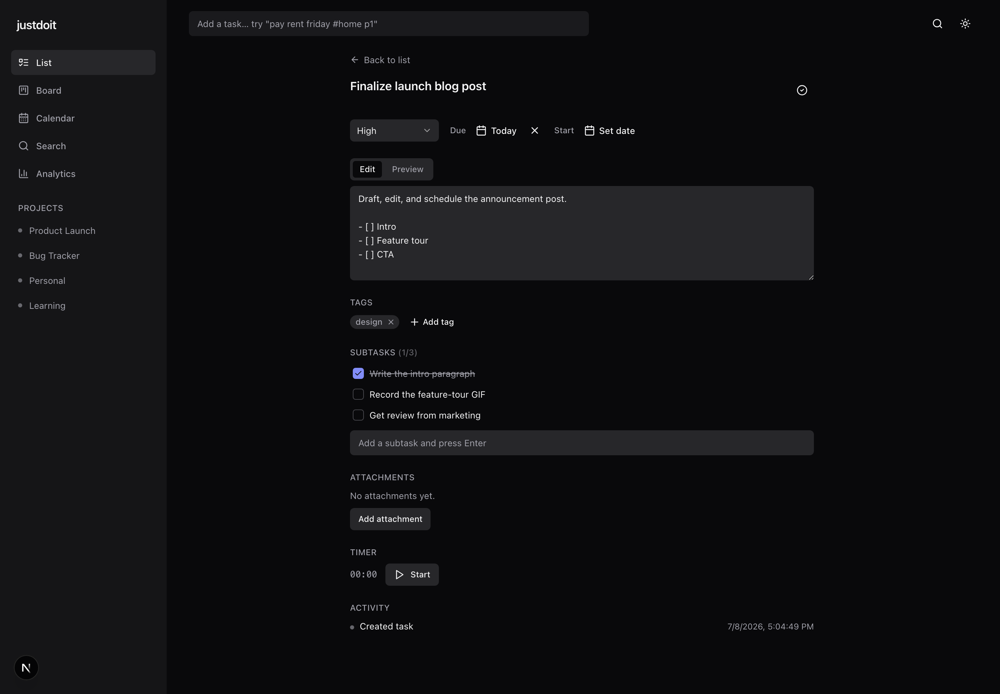
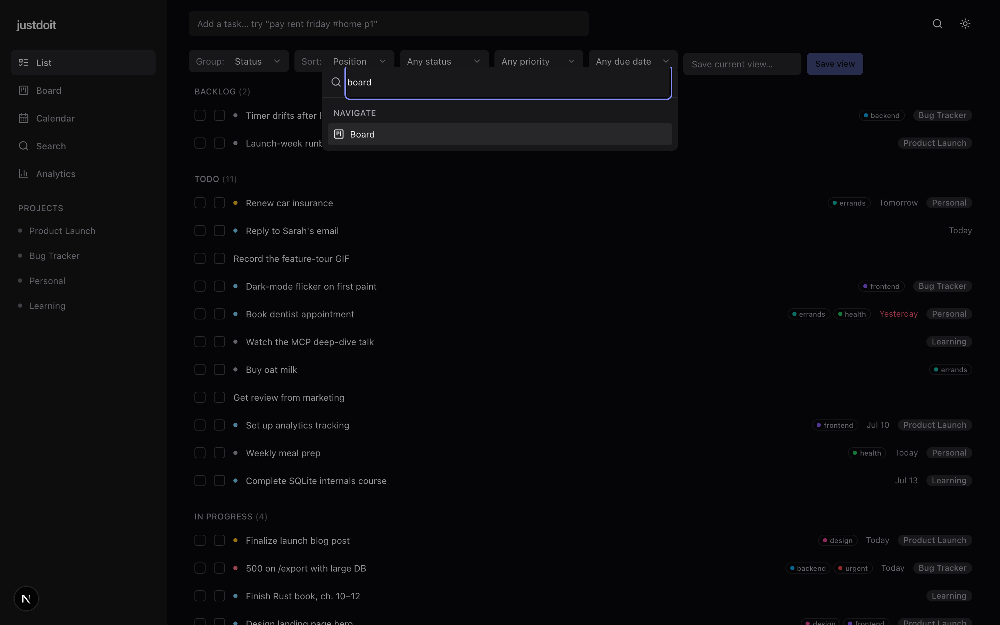

# JustDoIt

**A local-first, developer-friendly task manager with a REST API, an MCP server, and a sleek web UI — all over one shared core.**

JustDoIt keeps your to-dos, their status, and the time you spend on them in a single local SQLite file. Manage them however you like: click around a minimal web app, hit a plain REST API from scripts, or let an AI agent manage your tasks through the built-in [Model Context Protocol](https://modelcontextprotocol.io) server. Every surface goes through the exact same validated code path, so an agent creating a task and you dragging a card on the board are doing the identical thing.

No accounts. No cloud. No telemetry. Your data is a file you own.

---

## Highlights

- 🗂️ **Full task model** — projects/lists, tags, priorities (P0–P3), subtasks, markdown notes, and a clear status lifecycle (`backlog → todo → in_progress → blocked → done / cancelled`).
- ⏱️ **Time tracking** — start/stop timers (one running at a time), manual entries, estimates vs. actuals, and time reports grouped by day / project / tag.
- 📅 **Scheduling** — due & start dates, recurring tasks (RRULE), and reminders with local desktop notifications.
- 🧠 **Natural-language quick-add** — type `buy milk tomorrow 5pm #errands p1` and it becomes a task with the right due date, tag, and priority.
- 🤖 **MCP server** — 17 tools + resources + prompts so your agent harness (Claude Code, etc.) can manage your tasks directly.
- 🌐 **REST API** — a clean, headless HTTP surface you can automate against.
- ✨ **Sleek web UI** — keyboard-first, dark mode, ⌘K command palette, plus List / Kanban board / Calendar views and an analytics dashboard.
- 🔒 **Local-first & private** — one SQLite file; optional API-key auth when you want to expose it.

---

## Screenshots

_A quick tour, with demo data._

**List view** — group by status, filter, save views; tag pills, priorities, and due dates (overdue in red) at a glance.



**Kanban board** — drag tasks across status columns.



| Calendar                                        | Analytics dashboard                                    |
| ----------------------------------------------- | ------------------------------------------------------ |
|  |  |

| Task detail                                      | Command palette (⌘K)                                     |
| ------------------------------------------------ | -------------------------------------------------------- |
|  |  |

---

## Architecture

One core, three thin adapters. All business logic and validation lives in `packages/core`; the REST API, MCP server, and web UI are adapters over it.

```
                    ┌─────────────────────────────┐
   Web UI  ──HTTP──▶│      apps/api (Hono REST)    │──┐
                    └─────────────────────────────┘  │
                                                      ▼
                    ┌─────────────────────────────────────────────┐
   AI Agent ─stdio─▶│  apps/mcp (MCP server, imports core direct)  │──▶  packages/core
                    └─────────────────────────────────────────────┘      (domain logic,
                                                      ▲                    Drizzle + SQLite,
   Scripts ──HTTP────────────────────────────────────┘                    Zod validation)
                                                                                  │
                                                                                  ▼
                                                                          justdoit.db (SQLite)
```

| Package         | What it is                                                                                                                                                                              |
| --------------- | --------------------------------------------------------------------------------------------------------------------------------------------------------------------------------------- |
| `packages/core` | Domain logic, Drizzle ORM schema + migrations, SQLite access, Zod schemas. All business rules.                                                                                          |
| `apps/api`      | [Hono](https://hono.dev) HTTP server exposing the REST API. Thin adapter over core.                                                                                                     |
| `apps/mcp`      | MCP server ([`@modelcontextprotocol/sdk`](https://github.com/modelcontextprotocol)) — imports core in-process (works even when the API/UI is down). stdio + streamable-HTTP transports. |
| `apps/web`      | [Next.js 15](https://nextjs.org) App Router UI. A pure client of the REST API.                                                                                                          |

**Stack:** TypeScript · pnpm workspaces + Turborepo · SQLite (`better-sqlite3`) + Drizzle ORM · Zod · Hono · Next.js 15 + Tailwind + shadcn/ui + TanStack Query · Vitest + Playwright.

---

## Quick start

**Prerequisites:** [Node.js](https://nodejs.org) ≥ 22 and [pnpm](https://pnpm.io) 10 (`corepack enable` will provide it).

```bash
git clone git@github.com:deshraj/JustDoIt.git
cd JustDoIt
pnpm install
```

Run everything (API + web) in dev mode with one command:

```bash
pnpm dev
```

- **Web UI** → http://localhost:3000
- **REST API** → http://localhost:8787

Or run just the pieces you want:

```bash
# REST API only (port 8787)
pnpm --filter @justdoit/api dev

# Web UI only (port 3000) — expects the API at http://localhost:8787
pnpm --filter @justdoit/web dev
```

Your data lands in `justdoit.db` in the repo root by default (override with `JUSTDOIT_DB`). Back it up by copying that file.

> **Try it:** create your first task from the command line —
>
> ```bash
> curl -X POST http://localhost:8787/quick-add \
>   -H 'Content-Type: application/json' \
>   -d '{"text":"Ship JustDoIt v1 friday 5pm #launch p1"}'
> ```
>
> …then refresh the web UI.

---

## The web UI

Open http://localhost:3000. It's built to stay out of your way:

- **Views:** List, Kanban board (drag to change status), and Calendar.
- **Quick-add bar** with natural-language parsing.
- **⌘K command palette** — jump to any task/project, run actions, switch views, toggle theme.
- **Task detail** — markdown description, subtasks, tags, priority, due/start dates, an inline timer, attachments, and activity history.
- **Analytics dashboard** — time per day/project/tag, estimate vs. actual, throughput.
- **Live sync** — changes from the API/agent stream to the UI over SSE.
- **Keyboard shortcuts** — press `?` for the cheatsheet. Dark mode by default.

---

## The REST API

Base URL: `http://localhost:8787`. Everything is JSON. A few of the endpoints:

| Method & path                                              | Purpose                        |
| ---------------------------------------------------------- | ------------------------------ |
| `GET/POST /tasks`, `GET/PATCH/DELETE /tasks/:id`           | Task CRUD                      |
| `PATCH /tasks/:id/status`, `POST /tasks/:id/complete`      | Move through the lifecycle     |
| `GET/POST /tasks/:id/subtasks`                             | Subtasks                       |
| `POST /tasks/:id/timer/start` · `/stop`                    | Timers                         |
| `GET/POST /time-entries`, `PATCH/DELETE /time-entries/:id` | Manual time entries            |
| `GET /reports/time?group_by=day\|project\|tag&from=&to=`   | Time reports                   |
| `GET/POST /projects`, `GET/POST /tags`                     | Projects & tags                |
| `GET/POST /reminders`                                      | Reminders                      |
| `GET /search?q=`                                           | Full-text search               |
| `POST /quick-add`                                          | Natural-language task creation |
| `GET /export` · `POST /import`                             | JSON backup / restore          |
| `GET /events`                                              | Server-Sent Events stream      |

Task-list filters are snake_case query params, e.g. `GET /tasks?status=todo&project_id=<id>&due=today`.

---

## The MCP server (use JustDoIt from an AI agent)

The MCP server lets an agent harness read and manage your tasks. It talks to the same local database directly, so it works even when the API and web UI aren't running.

Register it in your agent's MCP config (e.g. Claude Code's `mcpServers`):

```json
{
  "mcpServers": {
    "justdoit": {
      "command": "pnpm",
      "args": ["--filter", "@justdoit/mcp", "exec", "tsx", "src/stdio.ts"],
      "env": { "JUSTDOIT_DB": "/absolute/path/to/JustDoIt/justdoit.db" }
    }
  }
}
```

**Tools (17):** `create_task`, `update_task`, `list_tasks`, `get_task`, `set_status`, `complete_task`, `delete_task`, `start_timer`, `stop_timer`, `log_time`, `create_project`, `list_projects`, `add_tag`, `search_tasks`, `get_time_report`, `set_reminder`, `quick_add`.

**Resources:** `task://{id}`, `project://{id}`, `tasks://today`, `tasks://overdue`.
**Prompts:** `plan_my_day`, `summarize_progress`.

There's also a streamable-HTTP transport for remote/managed setups:

```bash
pnpm --filter @justdoit/mcp start:http   # honors JUSTDOIT_MCP_PORT and JUSTDOIT_API_KEY
```

---

## Configuration

All configuration is via environment variables.

| Variable                     | Default                                       | Description                                                                                                      |
| ---------------------------- | --------------------------------------------- | ---------------------------------------------------------------------------------------------------------------- |
| `JUSTDOIT_DB`                | `justdoit.db`                                 | Path to the SQLite database file (use `:memory:` for a throwaway DB).                                            |
| `JUSTDOIT_API_PORT`          | `8787`                                        | Port for the REST API.                                                                                           |
| `JUSTDOIT_API_HOST`          | `127.0.0.1`                                   | Host the REST API binds to.                                                                                      |
| `JUSTDOIT_API_KEY`           | _(unset)_                                     | If set, the REST API and MCP HTTP transport require a matching `X-API-Key` header. Unset = open (localhost dev). |
| `JUSTDOIT_CORS_ORIGIN`       | `http://localhost:3000,http://localhost:8787` | Allowed CORS origins for the API.                                                                                |
| `JUSTDOIT_FILES_DIR`         | `./data/files`                                | Where task attachments are stored.                                                                               |
| `JUSTDOIT_DISABLE_SCHEDULER` | _(unset)_                                     | Set to `1` to disable the reminder scheduler / desktop notifications.                                            |
| `JUSTDOIT_MCP_PORT`          | `8788`                                        | Port for the MCP streamable-HTTP transport.                                                                      |
| `NEXT_PUBLIC_API_URL`        | `http://localhost:8787`                       | Web UI → REST API base URL.                                                                                      |

---

## Development

```bash
pnpm test          # run all test suites (Vitest)
pnpm typecheck     # type-check every package
pnpm lint          # ESLint across the workspace
pnpm format        # Prettier --write
pnpm --filter @justdoit/web test:e2e   # Playwright end-to-end tests
```

The domain layer is developed test-first; the suite covers core services, REST routes, MCP tools, and web components/e2e.

### Project structure

```
JustDoIt/
├── packages/
│   └── core/          # domain logic, Drizzle schema + migrations, Zod schemas, services
├── apps/
│   ├── api/           # Hono REST server
│   ├── mcp/           # MCP server (stdio + HTTP)
│   └── web/           # Next.js 15 web UI
├── docs/              # design spec & implementation plans
└── justdoit.db        # your data (gitignored)
```

### Database migrations

The schema lives in `packages/core/src/db/schema.ts`. After changing it:

```bash
pnpm --filter @justdoit/core db:generate   # generate a new migration
```

Migrations are applied automatically on startup.

---

## Roadmap / not yet built

JustDoIt is single-user and local by design. Deliberately out of scope for now (but the data model stays forward-compatible): multi-user & collaboration, cloud sync, mobile/native apps, third-party calendar (Google/Apple) sync, and custom statuses/workflows.

---

## License

MIT © [deshraj](https://github.com/deshraj)

---

<sub>Built as a fully-planned, phased project — see `docs/superpowers/` for the design spec and per-phase implementation plans.</sub>
